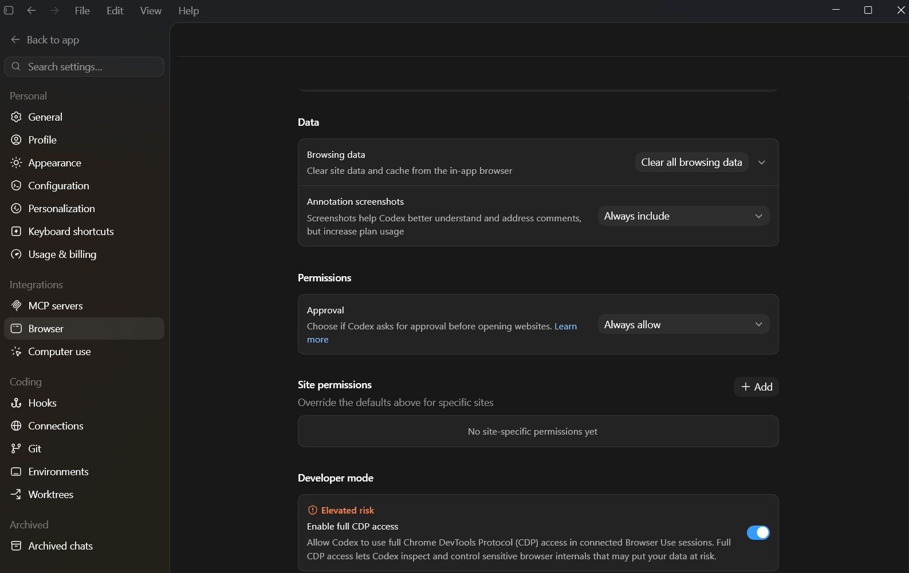

# Codex CDP Tutorial

This repository documents a short tutorial journey around Codex Browser Use and Chrome DevTools Protocol (CDP) access.

The starting point was a YouTube video about Codex gaining CDP support inside Browser Use. The video explains that Codex can now use CDP to inspect console logs, runtime errors, local storage, applied styling, network traffic, and performance profiles while working on web applications.

Source video:

https://www.youtube.com/watch?v=bhgYFRZLyKI

## What the Video Shows

The video frames CDP as a deeper debugging layer for Codex Browser Use.

In the demo, Codex investigates a slow chat app. Instead of only reading the code or clicking through the page, Codex can inspect runtime evidence from the browser:

- Console logs.
- Runtime errors.
- Local storage.
- Applied styling.
- Network traffic.
- Performance profiles.

The core example is a chat application that slows down as the conversation list grows. Typing becomes delayed, and page loading gets worse. With CDP, Codex can profile the app, inspect network requests, identify bottlenecks, make fixes, and support those fixes with measurements.

## The Codex Setting

The relevant setting appears in the Codex app under Browser settings:

The setting reads:

> Developer mode  
> Elevated risk  
> Enable full CDP access  
> Allow Codex to use full Chrome DevTools Protocol (CDP) access in connected Browser Use sessions. Full CDP access lets Codex inspect and control sensitive browser internals that may put your data at risk.

That wording matters. Full CDP access is useful, but it is not just normal browser clicking. It gives Codex access to sensitive browser internals.

## Browser Use vs. CDP

Browser Use is the high-level browser automation layer. It lets Codex operate a browser like a user or tester:

- Open a page.
- Click buttons.
- Type into fields.
- Scroll.
- Inspect visible page state.
- Take screenshots.
- Verify user-visible behavior.

CDP is the lower-level Chrome DevTools Protocol. It lets Codex inspect what is happening inside the browser:

- Which network requests fired.
- Which requests failed.
- What status codes and timings were returned.
- What console warnings or runtime errors occurred.
- What values are stored in local storage or session storage.
- Which CSS rules are applied to an element.
- Where long tasks or performance bottlenecks occur.

The simplest distinction:

- Browser Use answers: what is happening on the page?
- CDP answers: what is happening inside the browser while the page runs?

## Does Browser Use Automatically Invoke Full CDP?

For the elevated setting shown above, full CDP access should be treated as opt-in.

The video says that to use this deeper functionality, the user must enable Developer mode in the Codex app's Browser settings and explicitly approve when Codex starts using CDP to inspect a website.

There may be internal browser automation mechanisms behind Browser Use, but that is different from granting full DevTools-level access to inspect sensitive browser internals.

## Why CDP Is Marked Elevated Risk

CDP can reveal information that is not visible in a screenshot or ordinary page interaction.

Examples of data CDP may expose:

- API request headers.
- Private API responses.
- Local storage values.
- Session storage values.
- Auth-related browser state.
- Full request URLs and query parameters.
- Console logs that accidentally contain secrets.
- Typed form data.
- Hidden application state.

That is why CDP is valuable for debugging and risky for privacy. It gives the agent better evidence, but that evidence can include sensitive data.

## Our Development Journey So Far

This repo began as a local notes folder with:

- A transcript of the YouTube video.
- Screenshots of the Codex Browser settings.
- A short text note summarizing the Developer mode toggle.

We then turned that into a more structured explanation:

1. Read the local transcript.
2. Explained Browser Use as the high-level browser-control layer.
3. Explained CDP as the DevTools-level inspection protocol.
4. Clarified that full CDP access is gated by Developer mode and approval.
5. Compared what ordinary Browser Use can see against what CDP can inspect.
6. Drafted a future showcase plan without implementing it yet.

The current deeper explanation and implementation plan are captured in:

[browser_use_cdp_explainer_and_showcase_plan.md](browser_use_cdp_explainer_and_showcase_plan.md)

## Planned Showcase

The planned showcase is a small local demo app that will make the Browser Use vs. CDP distinction concrete.

The demo app should behave like a simplified slow chat application. Ordinary Browser Use should be able to reproduce the user-visible symptoms, while CDP should reveal the root causes.

Planned symptoms:

- A conversation list that becomes slow as it grows.
- Delayed typing caused by unnecessary JavaScript work.
- Duplicate or inefficient network requests.
- A failing API request hidden behind a vague UI error.
- Local storage state that changes behavior across refreshes.
- A styling issue caused by an unexpected applied CSS rule.
- Console-only errors that do not fully break the page.

Planned comparison:

| Scenario | Ordinary Browser Use | CDP |
| --- | --- | --- |
| Slow typing | Can observe visible lag | Can profile long tasks and main-thread blocking |
| Generic error | Can see the UI error | Can inspect the failing request and response |
| Duplicate loading | Can notice slowness | Can see duplicate network requests |
| Stale state | Can see unexpected UI | Can inspect local storage or session storage |
| Styling bug | Can see the visual problem | Can inspect computed CSS and matched rules |
| Hidden runtime issue | May not notice it | Can read console errors and stack traces |

## Repository Scope

This repository currently contains documentation and screenshots only. The demo app has not been implemented yet.

Committed artifacts:

- `README.md`: this source-and-journey overview.
- `browser_use_cdp_explainer_and_showcase_plan.md`: detailed explanation and showcase plan.
- `turning_on_CDP_codex.jpg`: screenshot of the full CDP access setting.
- `developer_mode_CDP_codex.jpg`: supporting screenshot from the Codex Browser settings.

Raw text notes and transcript files are intentionally excluded from git with `*.txt`.

## Current Status

Status: documentation phase complete.

Next step: implement the local `cdp_vs_browser_use_demo` app and add a CDP probe walkthrough that collects console, network, storage, style, and performance evidence.
