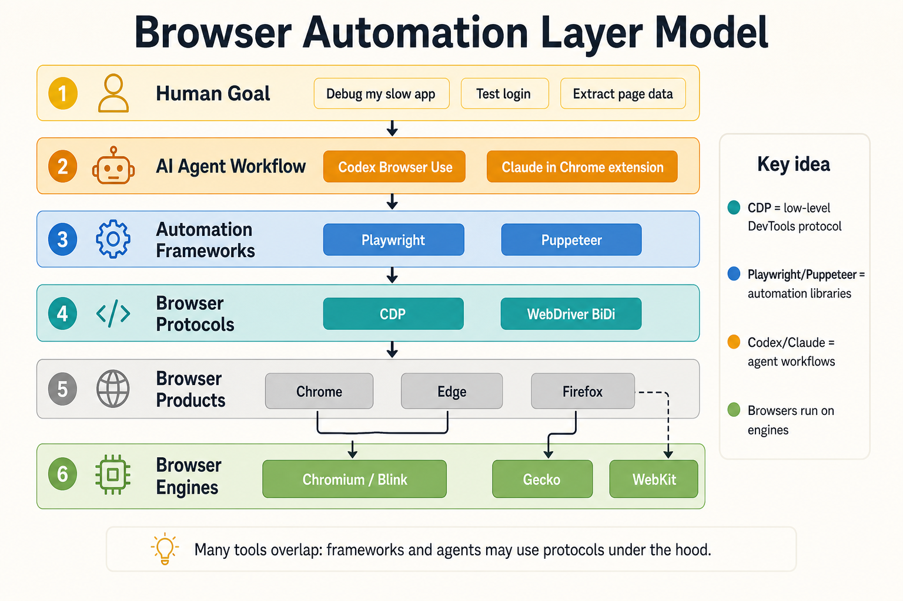

# CDP vs Playwright, Puppeteer, and Claude in Chrome

This document explains how Chrome DevTools Protocol (CDP) differs from Playwright, Puppeteer, and the Claude Code Chrome extension.

It assumes no prior CDP experience.

## Infographic



## Short Answer

CDP is not the same kind of thing as Playwright, Puppeteer, or Claude in Chrome.

CDP is a low-level browser protocol. It is the DevTools-level interface for inspecting, debugging, profiling, and controlling Chromium-based browsers.

Playwright and Puppeteer are browser automation libraries. They give developers friendlier APIs for opening browsers, clicking, typing, testing pages, taking screenshots, intercepting requests, and collecting artifacts.

Claude in Chrome is an agent integration. It connects Claude Code to a visible Chrome or Edge browser through the Claude browser extension so Claude can perform browser tasks as part of a coding workflow.

In one sentence:

> CDP is the browser's diagnostic/control protocol; Playwright and Puppeteer are developer automation frameworks; Claude in Chrome is an AI agent workflow that uses browser capabilities on your behalf.

## Layer Model

Think of the stack like this:

```text
Human goal
  "Debug my slow web app"
        |
AI agent workflow
  Claude in Chrome, Codex Browser Use, etc.
        |
Automation framework or browser tool layer
  Playwright, Puppeteer, extension tools, agent browser tools
        |
Browser control and inspection protocols
  CDP, WebDriver BiDi, browser-specific protocols
        |
Browser engine
  Chrome, Edge, Chromium, Firefox, WebKit
```

The layers are often combined. For example, Puppeteer can control Chrome over CDP. Playwright can connect to Chromium over CDP, but its normal full-fidelity path uses Playwright's own protocol. Claude in Chrome is not a raw protocol library; it is an interactive product integration that exposes browser actions to an AI agent.

## What CDP Is

CDP stands for Chrome DevTools Protocol.

The official CDP site describes it as a protocol that lets tools instrument, inspect, debug, and profile Chromium, Chrome, and other Blink-based browsers.

CDP is divided into domains such as:

- `Network`
- `Runtime`
- `DOM`
- `CSS`
- `Debugger`
- `Performance`
- `Storage`
- `Page`
- `Tracing`

Each domain provides commands and events. For example:

- `Network.enable` starts network event collection.
- `Runtime.evaluate` runs JavaScript in the page context.
- `CSS.getComputedStyleForNode` reads computed CSS.
- `Performance.getMetrics` reads browser performance metrics.
- `Page.captureScreenshot` captures a screenshot.

In this repo's demo, [cdp_probe.js](cdp_vs_browser_use_demo/cdp_probe.js) uses CDP directly. It opens a Chrome debugging connection and asks the browser for console events, runtime exceptions, network requests, storage, computed styles, and performance metrics.

CDP is powerful because it is close to the browser's internals. That is also why full CDP access is sensitive.

## What Playwright Is

Playwright is a high-level browser automation and end-to-end testing framework.

The official Playwright docs describe Playwright Test as an end-to-end test framework for modern web apps. It includes a test runner, assertions, isolation, parallelization, and tooling. It supports Chromium, WebKit, and Firefox across Windows, Linux, and macOS.

Playwright is usually what you want when your goal is:

- Write repeatable browser tests.
- Test across Chromium, Firefox, and WebKit.
- Use locators like `getByRole`, `getByText`, and `getByLabel`.
- Record traces and screenshots for test debugging.
- Run headless tests in CI.
- Control browser contexts and isolation.

Playwright can connect to Chromium over CDP with `connectOverCDP`, but the Playwright docs call that path lower fidelity than Playwright's own protocol connection. That distinction matters: CDP is available as an attachment mode, but Playwright's main value is the higher-level testing API and cross-browser model.

## What Puppeteer Is

Puppeteer is a high-level JavaScript browser automation library.

The official Puppeteer docs describe it as a JavaScript library that provides a high-level API to control Chrome or Firefox over the DevTools Protocol or WebDriver BiDi.

Puppeteer is usually what you want when your goal is:

- Automate Chrome or Firefox from Node.js.
- Open a page and script browser actions.
- Generate screenshots or PDFs.
- Scrape or extract page data.
- Use a Chrome-centered automation model.
- Access CDP more directly when needed.

Puppeteer is closer to CDP than Playwright in historical and conceptual terms because it was built around Chrome automation and CDP. But it is still not CDP itself. Puppeteer is a library that wraps lower-level browser protocols in a developer-friendly API.

## What Claude in Chrome Is

Claude in Chrome is a Claude Code integration with the Claude browser extension.

The Claude Code documentation says the Chrome integration connects Claude Code to Chrome so it can test web apps, debug with console logs, automate form filling, and extract data from web pages. It opens new tabs for browser tasks, runs actions in a visible Chrome window, and shares the browser's login state so Claude can access sites where you are already signed in. When Claude hits a login page or CAPTCHA, it pauses and asks you to handle it manually.

Claude in Chrome is usually what you want when your goal is:

- Ask an AI agent to test a local web app.
- Have the agent inspect browser-visible behavior and console logs.
- Automate browser tasks from a coding session.
- Work in a browser that can share your existing login state.
- Combine code edits and live browser verification.

It is not primarily a programming library. It is an agent-facing workflow surface. The important unit is not "call `Network.enable`" or "write a test with `expect`"; the important unit is a natural-language task such as:

```text
Open localhost:3000, submit the login form with invalid data, and tell me whether the validation errors appear.
```

## Comparison Table

| Tool or layer | What it is | Best mental model | Main audience | Typical use |
| --- | --- | --- | --- | --- |
| CDP | Low-level browser protocol | Programmable DevTools | Tool builders, debugger authors, advanced automation | Inspect network, runtime, DOM, CSS, storage, performance, tracing |
| Playwright | Browser automation and testing framework | Cross-browser test harness | App developers and QA engineers | End-to-end tests, reliable locators, traces, CI, multi-browser testing |
| Puppeteer | Browser automation library | Node.js API for browser control | Developers automating Chrome/Firefox workflows | Scripting pages, screenshots, PDFs, scraping, Chrome-centered automation |
| Claude in Chrome | AI agent browser integration | Claude using your visible browser | Developers using Claude Code | Ask Claude to test, debug, fill forms, inspect console logs, or extract data |

## How They Relate

### CDP vs Playwright

CDP is lower level.

Playwright gives you a testing vocabulary:

```js
await page.getByRole("button", { name: "Submit" }).click();
await expect(page.getByText("Saved")).toBeVisible();
```

CDP gives you browser protocol commands:

```js
await client.send("Network.enable");
await client.send("Runtime.evaluate", { expression: "localStorage" });
```

Use Playwright when you want reliable user-flow tests. Use CDP when you need raw DevTools-level evidence or a browser feature that the test framework does not expose.

### CDP vs Puppeteer

Puppeteer is a JavaScript library. CDP is one of the lower-level protocols Puppeteer can use.

Puppeteer code usually looks like:

```js
const browser = await puppeteer.launch();
const page = await browser.newPage();
await page.goto("http://localhost:4173");
await page.click("button");
```

Raw CDP code usually looks like:

```js
await cdp.send("Page.navigate", { url: "http://localhost:4173" });
await cdp.send("CSS.getComputedStyleForNode", { nodeId });
```

Use Puppeteer when you want a convenient Node API. Use raw CDP when you need exact protocol domains, events, or commands.

### CDP vs Claude in Chrome

Claude in Chrome is an AI-driven browser workflow, not a low-level browser protocol.

With Claude in Chrome, you ask for an outcome:

```text
Open the dashboard and check the console for errors.
```

With CDP, a tool asks the browser for specific internals:

```text
Runtime.consoleAPICalled
Network.responseReceived
DOMStorage.domStorageItemAdded
CSS.getComputedStyleForNode
```

Claude in Chrome can use browser capabilities to help debug, but you are not normally writing protocol commands. You are delegating a task to Claude. CDP is the lower-level mechanism a tool may use under the hood, or that an advanced script can call directly.

## What CDP Can Do That Frameworks May Abstract Away

Playwright and Puppeteer expose many browser capabilities, and both can reach lower-level protocol features in some cases. But raw CDP is still different because it exposes the protocol domains directly.

CDP is useful when you need to:

- Subscribe to exact browser events.
- Inspect protocol-level network details.
- Read or modify browser storage through DevTools domains.
- Run page-context JavaScript with `Runtime.evaluate`.
- Inspect computed style through the CSS domain.
- Capture performance metrics or traces.
- Use a newly added Chromium feature before a framework wraps it.
- Build a debugging tool rather than a test.

The tradeoff is that CDP is more verbose, more browser-specific, and easier to misuse.

## What Playwright and Puppeteer Do Better Than Raw CDP

Raw CDP is powerful, but it is not ergonomic.

Playwright and Puppeteer do a lot of work for you:

- Launch browsers.
- Manage pages and contexts.
- Provide friendly click/type APIs.
- Wait for elements.
- Handle navigation timing.
- Take screenshots.
- Provide structured test or automation patterns.
- Hide much of the protocol plumbing.

Playwright adds especially strong testing features:

- Test runner.
- Assertions.
- Parallelization.
- Browser isolation.
- Trace viewer.
- Multi-browser support.

Puppeteer adds a compact Node automation API that maps naturally to Chrome-oriented scripting.

## What Claude in Chrome Does Better Than Raw CDP

Claude in Chrome is valuable because it combines browser control with reasoning and code editing.

Instead of writing automation code first, you can ask Claude to:

- Reproduce a bug.
- Inspect console errors.
- Compare the app against expected behavior.
- Fill forms.
- Extract structured data.
- Fix the local source code.
- Re-test after the fix.

That is a higher-level workflow than CDP, Playwright, or Puppeteer by themselves.

The downside is that it is less deterministic than a test script. It is best for interactive debugging, exploratory testing, and agent-assisted workflows. Once you know the behavior you want to preserve, encode it in a test.

## Security and Privacy Differences

These tools have different risk profiles.

| Tool or layer | Main risk |
| --- | --- |
| CDP | Direct access to browser internals, storage, network data, runtime evaluation, and debugging surfaces |
| Playwright | Automated browser actions can submit forms, alter state, or expose stored test credentials |
| Puppeteer | Similar automation risks; can also use CDP-level access when scripts request it |
| Claude in Chrome | Agent can interact with visible logged-in browser state; the extension shares login context and site permissions matter |

The highest-risk pattern is connecting automation or agent tools to your normal logged-in browser profile and then granting broad access. For learning, use a local demo app and a temporary browser profile.

## Practical Rule of Thumb

Use this decision guide:

| Goal | Prefer |
| --- | --- |
| I want to understand browser internals | CDP |
| I want reliable app tests in CI | Playwright |
| I want a small Node script to automate Chrome | Puppeteer |
| I want an AI coding agent to test and debug my app interactively | Claude in Chrome or Codex Browser Use |
| I want to preserve a bug fix permanently | Playwright test or another automated test |
| I want to explain why a visible bug happens internally | CDP evidence, possibly collected by an agent |

## How This Maps to This Repo

This repo's demo deliberately separates the layers:

- The visible app at `http://localhost:4173` can be tested by ordinary browser interaction.
- The Browser Use walkthrough shows what a user-level browser agent can observe.
- The CDP walkthrough shows what DevTools-level inspection can reveal.
- `cdp_probe.js` demonstrates raw CDP access directly.

You could rewrite parts of the demo using Playwright or Puppeteer:

- A Playwright test could assert that the generic error appears after selecting a conversation.
- A Puppeteer script could open the app, click a conversation, and capture a screenshot.
- A Claude in Chrome session could ask Claude to explore the app and summarize console errors.

But the CDP probe is intentionally lower level. It shows the browser's internal evidence: console events, runtime exceptions, network responses, storage, computed styles, and performance metrics.

## Final Takeaway

CDP is the protocol.

Playwright and Puppeteer are automation frameworks that may use browser protocols underneath.

Claude in Chrome is an AI agent integration that uses a real browser to complete tasks.

They overlap, but they are not interchangeable. The right choice depends on whether you need low-level browser evidence, repeatable tests, scripted automation, or an agent that can reason across browser behavior and source code.

## Sources

- [Chrome DevTools Protocol](https://chromedevtools.github.io/devtools-protocol/)
- [Playwright installation and introduction](https://playwright.dev/docs/intro)
- [Playwright `connectOverCDP`](https://playwright.dev/docs/api/class-browsertype#browser-type-connect-over-cdp)
- [Puppeteer documentation](https://pptr.dev/)
- [Claude Code Chrome extension documentation](https://code.claude.com/docs/en/chrome)
